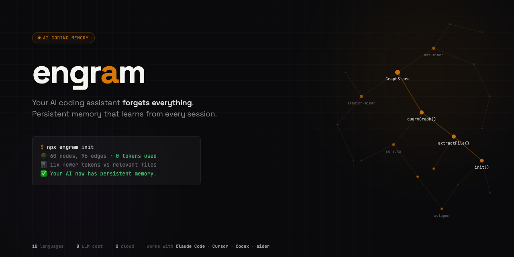

<p align="center">
  
</p>

<p align="center">
  <a href="#install"><strong>Install</strong></a> ·
  <a href="#usage"><strong>Usage</strong></a> ·
  <a href="#mcp-server"><strong>MCP Server</strong></a> ·
  <a href="#how-it-works"><strong>How It Works</strong></a> ·
  <a href="#contributing"><strong>Contributing</strong></a>
</p>

<p align="center">
  <a href="https://github.com/NickCirv/engram/actions"></a>
  
  
  
  
  
</p>

---

**Your AI coding assistant forgets everything. We fixed that.**

engram gives AI coding tools persistent memory. One command scans your codebase, builds a knowledge graph, and makes every session start where the last one left off.

Zero LLM cost. Zero cloud. Works with Claude Code, Cursor, Codex, aider, and any MCP client.

```bash
npx engram init
```

```
🔍 Scanning codebase...
🌳 AST extraction complete (42ms, 0 tokens used)
   60 nodes, 96 edges from 14 files (2,155 lines)

📊 Token savings: 11x fewer tokens vs relevant files
   Full corpus: ~15,445 tokens | Graph query: ~285 tokens

✅ Ready. Your AI now has persistent memory.
```

## Why

Every AI coding session starts from zero. Claude Code re-reads your files. Cursor reindexes. Copilot has no memory. CLAUDE.md is a sticky note you write by hand.

engram fixes this with three things no other tool combines:

1. **Persistent knowledge graph** — survives across sessions, stored in `.engram/graph.db`
2. **Learns from every session** — decisions, patterns, mistakes are extracted and remembered
3. **Universal protocol** — MCP server + CLI + auto-generates CLAUDE.md, .cursorrules, AGENTS.md

## Install

```bash
npx engram-ai init
```

Or install globally:

```bash
npm install -g engram-ai
engram init
```

Requires Node.js 20+. Zero native dependencies. No build tools needed.

## Usage

```bash
engram init [path]              # Scan codebase, build knowledge graph
engram query "how does auth"    # Query the graph (BFS, token-budgeted)
engram query "auth" --dfs       # DFS traversal (trace specific paths)
engram gods                     # Show most connected entities
engram stats                    # Node/edge counts, token savings
engram bench                    # Token reduction benchmark
engram path "auth" "database"   # Shortest path between concepts
engram learn "chose JWT..."     # Teach a decision or pattern
engram gen                      # Generate CLAUDE.md section from graph
engram hooks install            # Auto-rebuild on git commit
```

## How It Works

engram runs three miners on your codebase. None of them use an LLM.

**AST Miner** — Extracts code structure (classes, functions, imports, exports, call patterns) using pattern matching across 10 languages: TypeScript, JavaScript, Python, Go, Rust, Java, C, C++, Ruby, PHP. Zero tokens, deterministic, cached.

**Git Miner** — Reads `git log` for co-change patterns (files that change together), hot files (most frequently modified), and authorship. Creates INFERRED edges between structurally coupled files.

**Session Miner** — Scans CLAUDE.md, .cursorrules, AGENTS.md, and `.engram/sessions/` for decisions, patterns, and mistakes your team has documented. Stores these as queryable graph nodes.

Results are stored in a local SQLite database (`.engram/graph.db`) and queryable via CLI, MCP server, or programmatic API.

## MCP Server

Connect engram to Claude Code, Windsurf, or any MCP client:

```json
{
  "mcpServers": {
    "engram": {
      "command": "npx",
      "args": ["-y", "engram-ai", "serve", "/path/to/your/project"]
    }
  }
}
```

Or if installed globally:

```json
{
  "mcpServers": {
    "engram": {
      "command": "engram-serve",
      "args": ["/path/to/your/project"]
    }
  }
}
```

**MCP Tools:**
- `query_graph` — Search the knowledge graph with natural language
- `god_nodes` — Core abstractions (most connected entities)
- `graph_stats` — Node/edge counts, confidence breakdown
- `shortest_path` — Trace connections between two concepts
- `benchmark` — Token reduction measurement

## Auto-Generated AI Instructions

After building a graph, run:

```bash
engram gen                    # Auto-detect CLAUDE.md / .cursorrules / AGENTS.md
engram gen --target claude    # Write to CLAUDE.md
engram gen --target cursor    # Write to .cursorrules
engram gen --target agents    # Write to AGENTS.md
```

This writes a structured codebase summary — god nodes, file structure, key dependencies, decisions — so your AI assistant navigates by structure instead of grepping.

## How engram Compares

| | engram | Mem0 | Graphify | aider repo-map | CLAUDE.md |
|---|---|---|---|---|---|
| **Code structure** | AST extraction (10 langs) | No | Yes (tree-sitter) | Yes (tree-sitter) | No |
| **Persistent memory** | SQLite graph, survives sessions | Yes (vector + graph) | Static snapshot | Per-session only | Manual text file |
| **Session learning** | Mines decisions, patterns, mistakes | Generic facts | No | No | You write it by hand |
| **Universal** | MCP + CLI + auto-gen | API only | Claude Code only | aider only | Claude Code only |
| **LLM cost** | $0 | $0 (self-host) / paid cloud | Tokens for docs/images | Per-session | $0 |
| **Code-specific** | Built for codebases | Generic AI memory | Yes | Yes | No |
| **Temporal** | Git history mining | No | No | No | No |

**The gap nobody fills:** Code-structural understanding + persistent cross-session learning + temporal awareness + works with every AI tool. engram is the first to combine all four.

## Confidence System

Every relationship in the graph is tagged:

| Tag | Meaning | Score |
|-----|---------|-------|
| **EXTRACTED** | Found directly in source code (import, function definition) | 1.0 |
| **INFERRED** | Reasoned from patterns (git co-changes, session decisions) | 0.4-0.9 |
| **AMBIGUOUS** | Uncertain, flagged for review | 0.1-0.3 |

You always know what was found vs guessed.

## Token Savings

engram reports two honest baselines:

- **vs relevant files** — compared to reading only the files that match your query. This is the fair comparison. Typical: **3-11x** fewer tokens.
- **vs full corpus** — compared to sending your entire codebase. This is the worst case you're avoiding. Typical: **30-400x** fewer tokens.

Both are reported transparently. No inflated claims.

## Git Hooks

Auto-rebuild the graph on every commit:

```bash
engram hooks install     # Install post-commit + post-checkout hooks
engram hooks status      # Check installation
engram hooks uninstall   # Remove hooks
```

Code changes trigger an instant AST rebuild (no LLM, <50ms). The graph stays fresh without manual re-runs.

## Programmatic API

```typescript
import { init, query, godNodes, stats } from "engram";

// Build the graph
const result = await init("./my-project");
console.log(`${result.nodes} nodes, ${result.edges} edges`);

// Query it
const answer = await query("./my-project", "how does auth work");
console.log(answer.text);

// Get god nodes
const gods = await godNodes("./my-project");
for (const g of gods) {
  console.log(`${g.label} — ${g.degree} connections`);
}
```

## Architecture

```
src/
├── cli.ts                 CLI entry point
├── core.ts                API surface (init, query, stats, learn)
├── serve.ts               MCP server (5 tools, JSON-RPC stdio)
├── hooks.ts               Git hook install/uninstall
├── autogen.ts             CLAUDE.md / .cursorrules generation
├── graph/
│   ├── schema.ts          Types: nodes, edges, confidence
│   ├── store.ts           SQLite persistence (sql.js, zero native deps)
│   └── query.ts           BFS/DFS traversal, shortest path
├── miners/
│   ├── ast-miner.ts       Code structure extraction (10 languages)
│   ├── git-miner.ts       Change patterns from git history
│   └── session-miner.ts   Decisions/patterns from AI session docs
└── intelligence/
    └── token-tracker.ts   Cumulative token savings measurement
```

## Supported Languages

TypeScript, JavaScript, Python, Go, Rust, Java, C, C++, Ruby, PHP.

Tree-sitter WASM integration (20+ languages with full call-graph precision) is planned for v0.2.

## Privacy

Everything runs locally. No data leaves your machine. No telemetry. No cloud. The only network call is `npm install`.

## License

Apache 2.0

## Contributing

Issues and PRs welcome. Run `engram init` on a real codebase and share what it got right and wrong.
