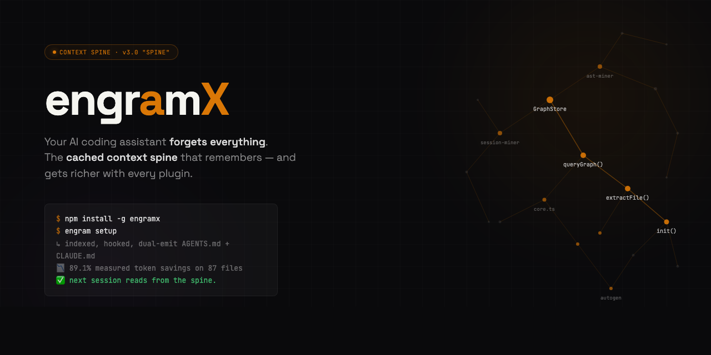
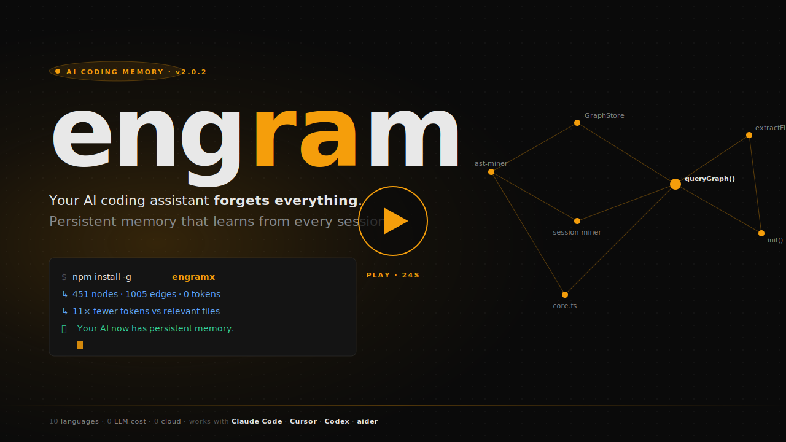
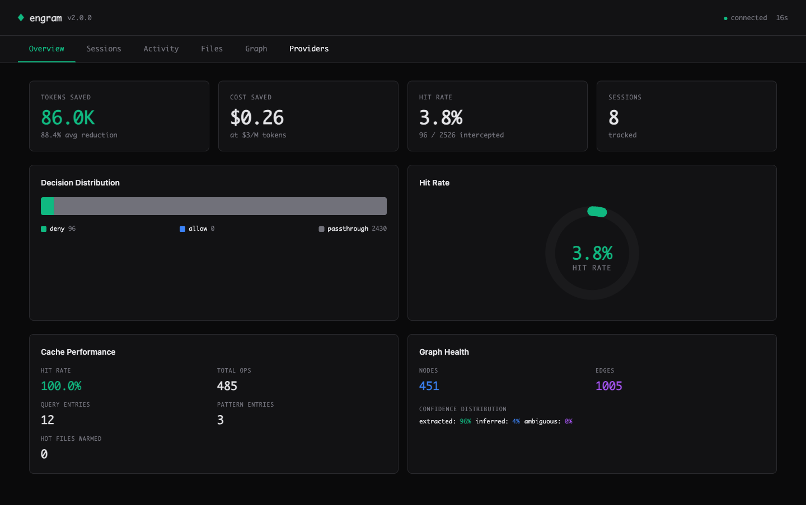
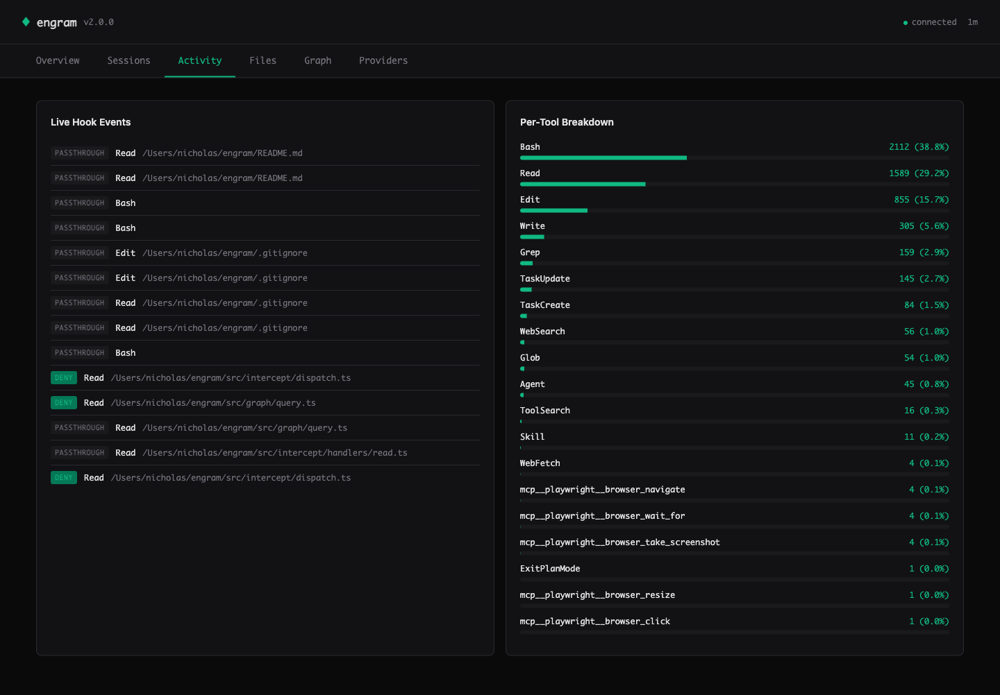
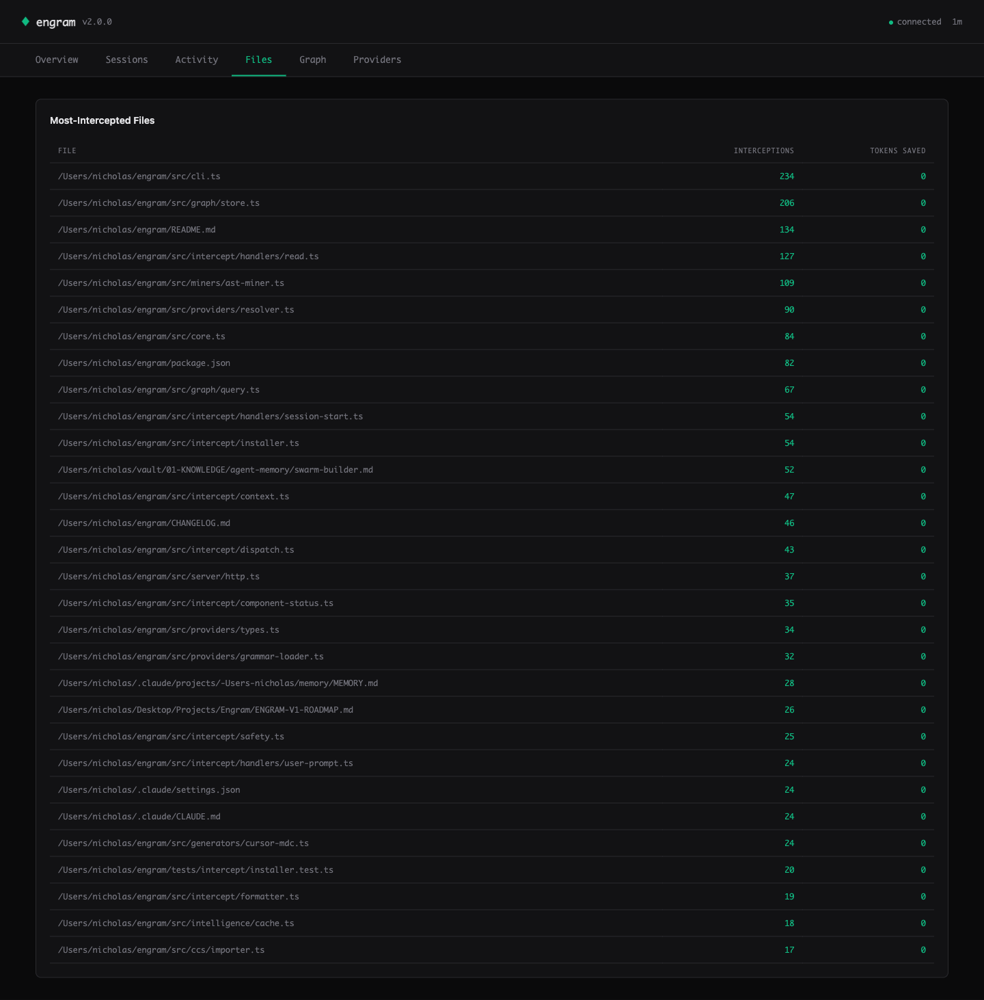
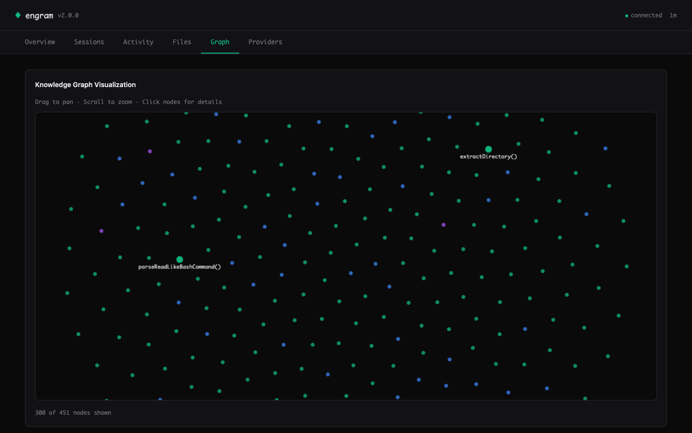
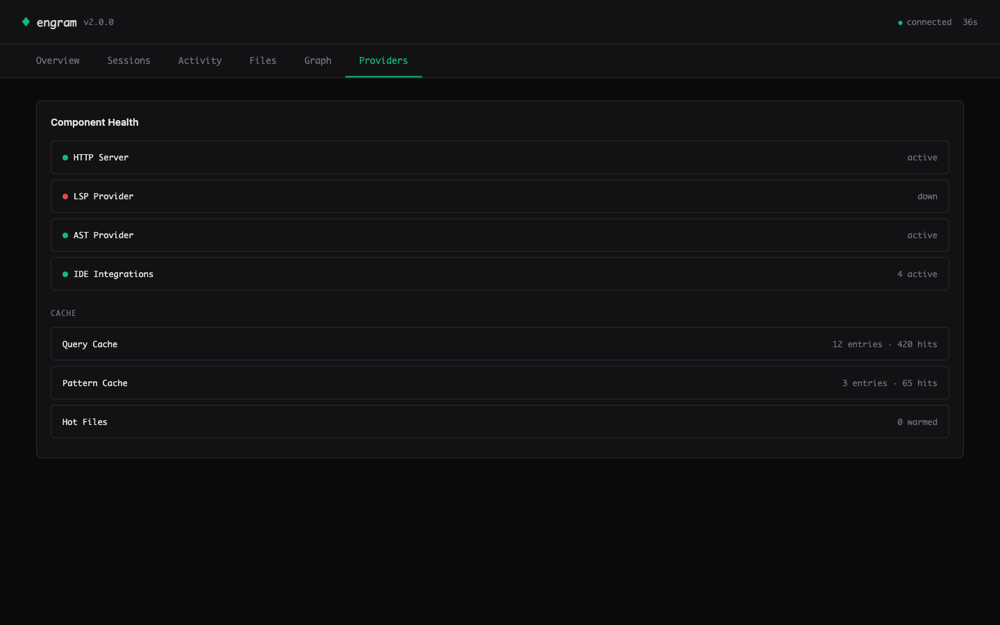

<p align="center">
  
</p>

<!-- ============================================================
     24-second product showcase (Hyperframes-rendered MP4 + WebM).
     Source: docs/demos/showcase.html · scenes drive both the
     live HTML player and this MP4. Edit scene-table.md to change.
     If the MP4 isn't rendered yet, GitHub gracefully shows the
     poster image and links to the live HTML player.
     ============================================================ -->
<p align="center">
  <video src="https://raw.githubusercontent.com/NickCirv/engram/main/docs/demos/showcase.mp4"
         controls
         muted
         playsinline
         poster="docs/demos/poster.svg"
         width="100%">
    <a href="docs/demos/showcase.html">
      
    </a>
  </video>
</p>

<p align="center">
  <sub>
    <a href="docs/install.html"><strong>Install Page</strong></a> ·
    <a href="docs/demos/showcase.html"><strong>Live Demo</strong></a> ·
    <a href="docs/demos/scene-table.md"><strong>Scene Table</strong></a> ·
    rendered with <a href="https://github.com/heygen-com/hyperframes">Hyperframes</a>
  </sub>
</p>

<p align="center">
  <a href="#install"><strong>Install</strong></a> ·
  <a href="#quickstart"><strong>Quickstart</strong></a> ·
  <a href="#dashboard"><strong>Dashboard</strong></a> ·
  <a href="#benchmark"><strong>Benchmark</strong></a> ·
  <a href="#ide-integrations"><strong>IDE Integrations</strong></a> ·
  <a href="#http-api"><strong>HTTP API</strong></a> ·
  <a href="#ecp-spec"><strong>ECP Spec</strong></a> ·
  <a href="#contributing"><strong>Contributing</strong></a>
</p>

<p align="center">
  <a href="https://github.com/NickCirv/engram/actions"></a>
  <a href="https://www.npmjs.com/package/engramx"></a>
  
  
  
  
  
  
  
</p>

---

> **EngramX v3.0 "Spine" shipped 2026-04-24** — the biggest release since v1.0. The spine is now **extensible**: any MCP server becomes an EngramX provider via a 10-line plugin file. **Pre-mortem mistake-guard** warns before you repeat a bug. **Bi-temporal mistake memory** — refactored-away mistakes stop firing. **Anthropic Auto-Memory bridge** reads Claude Code's own consolidated memory. **SSE-streaming** packets render progressively. `engram gen` dual-emits `AGENTS.md` + `CLAUDE.md` by default. **89.1% measured real-world token savings** on 87 source files — reproducible in one command. 878 tests, CI green on Ubuntu + Windows × Node 20 + 22. Zero cloud, zero telemetry. See [CHANGELOG.md](CHANGELOG.md) for the full diff.

---

# EngramX — the cached context spine for AI coding agents.

Your AI coding agent keeps re-reading the same files. Every `Read`, every `Edit`, every `cat` re-pays for context you've already paid for.

**EngramX is the spine.** It intercepts every file read at the tool boundary, answers from a pre-assembled context packet held in **three layers of cache** — a knowledge graph the agent has already "paid" to build, a per-provider SQLite cache of external lookups, and an in-memory LRU of recent queries — and hands the agent a single ~500-token response instead of a raw file.

The agent gets what it needs. You stop paying for context you've already paid for. And **every plugin you add elevates the savings further** — Serena for LSP symbols, GitHub MCP for issue context, Sentry MCP for production errors, Supabase / Neon for schema. Each one closes another context leak the agent would otherwise burn tokens researching.

**Measured savings on a reproducible benchmark: 89.1%.** Not estimated. 85 of 87 real source files saved tokens. Best case 98.4% (18,820 tokens → 306).

### One command to everything

```bash
npm install -g engramx
cd ~/my-project
engram setup
```

That's the install. `engram setup` runs `engram init` (builds the graph), `engram install-hook` (wires the Sentinel into your AI tool), detects your IDE, dual-emits `AGENTS.md` + `CLAUDE.md`, then runs `engram doctor` to verify everything green. Under 30 seconds on most projects. Works in Claude Code, Cursor, Codex CLI, Windsurf, GitHub Copilot Chat, JetBrains Junie, Aider, Zed, Continue — any agent that reads `AGENTS.md` or uses MCP.

The **next session** you open starts with the spine pre-loaded: project brief already in context, file reads intercepted, a live HUD showing cumulative savings, bi-temporal mistakes waiting to warn you, and any plugins you've added already answering their domains.

---

## I'm not a developer — what does this actually do?

Short answer: **your AI coding assistant stops charging you for the same information twice.**

Long answer:

1. You ask your AI assistant (Claude Code, Cursor, Codex, whatever) to help with a file.
2. The assistant tries to read that file. Normally it reads the whole thing, pays for every byte in tokens, and throws most of it away.
3. EngramX catches the read, answers with a cached summary (the 50–200 lines the agent actually needs, plus context from your git history, past mistakes, library docs, and anything else useful), and lets the agent work from that.
4. Your monthly AI bill drops. Multi-hour sessions stop hitting rate limits. The agent stops re-introducing bugs you already fixed — because EngramX remembers what broke.

It runs on your laptop. It doesn't send your code anywhere. It's Apache 2.0. There's no account, no login, no cloud. You install it once and forget it's there.

**Want even bigger savings?** Install a plugin. Each one closes a different context leak — see [Plugins multiply the savings](#plugins-multiply-the-savings) below. Drop a 10-line `.mjs` file in `~/.engram/plugins/` and the next session uses it.

---

## Proof, not promises

Everything above is measured, not estimated. `bench/real-world.ts` runs the full resolver against real files in this repo and compares the rich-packet token cost to the raw-file-read cost. Reproducible in one command on any project.

Latest run (2026-04-24, 87 source files — full report at [`bench/results/real-world-2026-04-24.md`](bench/results/real-world-2026-04-24.md)):

| Metric | Value |
|---|---|
| Baseline tokens (87 files read raw) | **163,122** |
| engramx tokens (rich packets) | **17,722** |
| Aggregate savings | **89.1%** |
| Median per-file savings | 84.2% |
| Files where engramx saved tokens | 85 of 87 |
| Best case (`src/cli.ts`) | 98.4% (18,820 → 306) |

Reproduce on your own code:

```bash
cd your-project
engram init                          # first-time setup for this project
npx tsx /path/to/engram/bench/real-world.ts --project . --files 50
```

The bench writes a JSON + Markdown report per run into `bench/results/`. Small projects score lower; dense structural projects score higher. It's real arithmetic on your files — you can audit every number.

---

## What engramx is not

The "engram" name is contested. To save you a search:

- **Not Go-Engram** ([Gentleman-Programming/engram](https://github.com/Gentleman-Programming/engram)) — different project, Go binary, salience-gated chat memory. Ships under `engram` (without the `x`).
- **Not DeepSeek's "Engram" paper** — January 2026 academic work on conditional memory. Research artifact, not a product.
- **Not MemPalace** — adjacent positioning ("knowledge-graph memory," "method-of-loci"), but conversational memory, not code-structural.

`engramx` is specifically: **a local-first context spine for AI coding agents that hooks into your IDE's tool boundary, indexes your code via tree-sitter + LSP, remembers past mistakes, and assembles ~500-token context packets in place of raw file reads.** Open source, Apache 2.0, single npm install.

---

## Dashboard

A zero-dependency web dashboard ships built-in. One command, opens in your browser:

```bash
engram ui
```

<p align="center">
  
</p>

The **Overview** tab: real metrics from your sessions — tokens saved, cost saved at $3/M rate, session-level hit rate, cache performance, graph health.

<p align="center">
  
</p>

**Activity** — live hook events streamed via Server-Sent Events. See every `Read` / `Edit` / `Write` decision (deny = intercepted, passthrough = engram couldn't help). Per-tool breakdown on the right shows where the savings come from.

<p align="center">
  
</p>

**Files** — the heatmap ranks your hot files by interception count. Cursor knows this view.

<p align="center">
  
</p>

**Graph** — Canvas 2D force-directed visualization of the knowledge graph. God nodes are larger and labeled. Drag to pan, scroll to zoom, click for details. 300+ nodes at 60fps.

<p align="center">
  
</p>

**Providers** — component health (HTTP / LSP / AST / IDE count) and per-layer cache stats (entries + cross-session hit counts).

### Design

- **35KB total** — one HTTP response, zero external CDN calls, works offline and on air-gapped machines.
- **Zero runtime dependencies** — all CSS and JS inlined as TypeScript template literals; SVG charts and Canvas 2D graph hand-rolled (~400 LOC total).
- **CSP-hardened** — `default-src 'self'; connect-src 'self'` meta tag plus `esc()` at every data-to-HTML boundary. Defends against attacker-controlled file paths and labels mined from untrusted repos.
- **Live-updating** — SSE stream pushes new hook events to the Activity tab within 1 second.

See also the **Sessions** tab (cumulative breakdown + sparkline) in [`assets/screenshots/02-sessions.png`](assets/screenshots/02-sessions.png).

---

## Benchmark

engramx ships with two benchmarks — use whichever fits your workflow.

### Real-world bench (new in v3.0, preferred)

`npx tsx bench/real-world.ts --project . --files 50` runs the full resolver against real files in any project and outputs exact token numbers. See the [Proof](#proof-not-promises) section above for the reproducible 89.1% result on engramx itself.

### Structured task bench (CI regression)

Measured across 10 structured coding tasks against a baseline of reading the relevant files directly. No synthetic data. No cherry-picked queries.

| Task | Baseline (tokens) | engram (tokens) | Savings |
|------|:-----------------:|:---------------:|:-------:|
| task-01-find-caller | 4,500 | 650 | 85.6% |
| task-02-parent-class | 2,800 | 400 | 85.7% |
| task-03-file-for-class | 3,200 | 300 | 90.6% |
| task-04-import-graph | 6,800 | 900 | 86.8% |
| task-05-exported-api | 5,500 | 700 | 87.3% |
| task-06-landmine-check | 8,200 | 850 | 89.6% |
| task-07-architecture-sketch | 14,500 | 1,600 | 89.0% |
| task-08-refactor-scope | 9,200 | 1,100 | 88.0% |
| task-09-hot-files | 3,800 | 550 | 85.5% |
| task-10-cross-file-flow | 12,800 | 1,400 | 89.1% |
| **Aggregate** | **7,130** | **845** | **88.1%** |

Run it yourself: `npx tsx bench/runner.ts` (structured fixtures) or `npx tsx bench/real-world.ts` (live resolver on real files).

---

## Plugins multiply the savings

The 89.1% number is engramx with its 9 built-in providers. Every MCP server you plug in closes another context gap the agent would otherwise burn tokens researching. And because every provider is budget-capped and the resolver is budget-weighted + mistakes-boost reranked, more plugins = more *relevant* context without packet bloat.

| Plugin | Closes this gap | Install |
|---|---|---|
| **Serena** (LSP symbols, 20+ languages) | Cross-file references engramx's AST can't resolve precisely — kills the grep-then-read loop | `cp docs/plugins/examples/serena-plugin.mjs ~/.engram/plugins/` |
| **GitHub MCP** (issues, PRs, commits) | Recent PR discussion & issue history for the file being edited | `engram plugin install github` |
| **Sentry MCP** (production errors) | "What broke in prod for this file" — cuts the open-dashboard → paste-trace loop | `engram plugin install sentry` |
| **Supabase / Neon** (schema, RLS) | Database schema context when editing queries / migrations / ORM models | `engram plugin install supabase` |
| **Context7** (library docs) | Always-current API surface for your actual imports | shipped as a built-in |
| **Anthropic Auto-Memory** | Claude Code's own consolidated project memory | shipped — auto-detected when `~/.claude/projects/…/memory/MEMORY.md` exists |

Writing a plugin is **~10 lines** — see [`docs/plugins/README.md`](docs/plugins/README.md) for the full spec + examples.

---

## What It Does

engram sits between your AI agent and the filesystem. When the agent reads a file, engram checks its knowledge graph. If the file is covered with sufficient confidence, it blocks the read and injects a compact context packet instead. The packet is assembled from up to 9 built-in providers plus any plugins you've added, all pre-cached at session start.

**The 9 built-in providers (v3.0):**

| Provider | Source | Confidence | Latency |
|----------|--------|:-----------:|:-------:|
| `engram:ast` | Tree-sitter parse (10 languages) | 1.0 | <50ms |
| `engram:structure` | Regex heuristics (fallback) | 0.85 | <50ms |
| `engram:mistakes` | Past failure nodes (bi-temporal — stale mistakes filtered out) | — | <10ms |
| `anthropic:memory` | Claude Code's auto-managed `MEMORY.md` index (v3.0) | 0.85 | <10ms |
| `engram:git` | Co-change patterns, churn, authorship | — | <100ms |
| `mempalace` | Decisions, learnings, project context | — | <5ms cached |
| `context7` | Library API docs for detected imports | — | <5ms cached |
| `obsidian` | Project notes, architecture docs | — | <5ms cached |
| `engram:lsp` | Live diagnostics captured as mistake nodes | — | on-event |

External providers cache into SQLite at SessionStart. Per-read resolution is a cache lookup, not a live call. If a provider is unavailable it is skipped silently — you always get at least the structural summary. **Plus: any MCP server becomes a provider via a 10-line plugin file** — see [Plugins multiply the savings](#plugins-multiply-the-savings) above.

**The 9 hook handlers:**

| Hook | What it does |
|------|-------------|
| `PreToolUse:Read` | Blocks the read if file is covered. Delivers structural summary as the block reason. |
| `PreToolUse:Edit` | Passes through. Injects known mistakes as landmine warnings alongside the edit. |
| `PreToolUse:Write` | Same as Edit — advisory injection only, never blocks writes. |
| `PreToolUse:Bash` | Catches `cat \| head \| tail \| less \| more <single-file>` and delegates to the Read handler. |
| `SessionStart` | Injects a compact project brief (god nodes, graph stats, top landmines, git branch). Bundles MemPalace context in parallel. |
| `UserPromptSubmit` | Extracts keywords from the prompt, runs a budget-capped pre-query, injects results before the agent responds. |
| `PostToolUse` | Observer only. Writes to `.engram/hook-log.jsonl` for `hook-stats`. |
| `PreCompact` | Re-injects god nodes and active landmines right before Claude compresses the conversation. Survives compaction. |
| `CwdChanged` | Auto-switches project context when you navigate to a different repo mid-session. |

**Ten safety invariants enforced at runtime:**

1. Any handler error → passthrough (Claude Code is never blocked)
2. 2-second per-handler timeout
3. Kill switch (`.engram/hook-disabled`) respected by every handler
4. Atomic settings.json writes with timestamped backups
5. Never intercept outside the project root
6. Never intercept binary files or secrets (`.env`, `.pem`, `.key`, `id_rsa`, etc.)
7. Never log user prompt content (privacy invariant, asserted in tests)
8. Never inject more than 8,000 chars per hook response
9. Stale graph detection — file mtime newer than graph mtime → passthrough
10. Partial-read bypass — explicit `offset` or `limit` on Read → passthrough

---

## Install

```bash
npm install -g engramx
```

Requires Node.js 20+. Zero native dependencies. No build tools. Local SQLite via sql.js WASM — no Rust, no Python, no system libs.

> **Prefer a designed walkthrough?** Open [**docs/install.html**](docs/install.html) — three-step install, benefits matrix, IDE coverage, FAQ. Local file, opens in any browser. Brand-matched terminal-mono aesthetic.

---

## Quickstart

**One command, zero friction:**

```bash
cd ~/my-project
engram setup                     # init + install-hook + adapter detect + doctor
```

`engram setup` runs the whole first-run flow interactively (or pass `-y` for defaults, `--dry-run` to preview). It is idempotent — safe to re-run, and skips any step already done.

<sub>Prefer the individual commands?</sub>

```bash
cd ~/my-project
engram init                      # scan codebase → .engram/graph.db (~40ms, 0 tokens)
engram install-hook              # wire the Sentinel into Claude Code
engram ui                        # open the web dashboard in your browser
```

**Diagnostics + self-update:**

```bash
engram doctor                    # component health + remediation hints (0=ok, 1=warn, 2=fail)
engram update                    # check + upgrade via detected pkg manager (no telemetry)
engram update --check            # check only, dry-probe the registry
```

Set `ENGRAM_NO_UPDATE_CHECK=1` to disable the passive "newer version available" hint on every CLI invocation. `$CI` does the same automatically.

Open a Claude Code session. When the agent reads a well-covered file you will see a system-reminder with the structural summary instead of file contents. After the session:

```bash
engram hook-stats                # what was intercepted, tokens saved (CLI)
engram ui                        # same data, richer view, real-time updates
engram hook-preview src/auth.ts  # dry-run: see what the hook would inject for one file
```

**Full recommended setup (one-time per project):**

```bash
npm install -g engramx
cd ~/my-project
engram init --with-skills        # also index ~/.claude/skills/ into the graph
engram install-hook              # wire Sentinel into Claude Code
engram hooks install             # auto-rebuild graph on every git commit
```

**Experience tiers — each works standalone:**

| Tier | What you run | What you get |
|------|-------------|-------------|
| Graph only | `engram init` | CLI queries, MCP server, `engram gen` for CLAUDE.md |
| + Sentinel | `engram install-hook` | Automatic Read interception, Edit warnings, session briefs, HUD |
| + Context Spine | Configure providers.json | Rich packets from 9 built-ins + any MCP plugin per read |
| + Skills index | `engram init --with-skills` | Graph includes your `~/.claude/skills/` |
| + Git hooks | `engram hooks install` | Graph rebuilds on every commit, stays current |
| + HTTP server | `engram server --http` | REST API on port 7337 for external tooling |

---

## IDE Integrations

| IDE | Integration | Setup |
|-----|------------|-------|
| **Claude Code** | Hook-based interception (native, automatic) | `engram install-hook` |
| **Cursor** | MDC snapshot + native MCP | `engram gen-mdc` &middot; [docs/integrations/cursor-mcp.md](docs/integrations/cursor-mcp.md) |
| **Continue.dev** | `@engram` context provider | [docs/integrations/continue.md](docs/integrations/continue.md) |
| **Zed** | Context server (`/engram`) | `engram context-server` |
| **Aider** | Context file generation | `engram gen-aider` |
| **Windsurf** (Codeium) | `.windsurfrules` snapshot + MCP | `engram gen-windsurfrules` |
| **Neovim** | MCP via codecompanion / avante | [docs/integrations/neovim.md](docs/integrations/neovim.md) |
| **Emacs** | MCP via gptel-mcp | [docs/integrations/emacs.md](docs/integrations/emacs.md) |

Per-IDE setup guides are in [`docs/integrations/`](docs/integrations/).

---

## How It Compares

| | engram | Continue @RepoMap | Cursor .cursorrules | Aider repo-map | @199-bio/engram |
|---|---|---|---|---|---|
| **Interception model** | Hook-based, automatic on every Read | Fetched at @-mention time | Static file, manual | Per-session map | MCP server, called explicitly |
| **Cache strategy** | SQLite at SessionStart, <5ms per read | No cache — live fetch | No cache | Per-session only | No cache |
| **Persistent memory** | Decisions, mistakes, patterns across sessions | No | Manual text file | No | No |
| **Multiple providers** | 8 (AST, git, mistakes, MemPalace, Context7, Obsidian, LSP) | Repo structure only | No | Repo structure only | Graph query only |
| **Mistake tracking** | LSP diagnostics → mistake nodes, ⚠️ on Edit | No | No | No | No |
| **Survives compaction** | Yes (PreCompact hook) | No | Yes (static file) | No | No |
| **LLM cost** | $0 | $0 | $0 | $0 | $0 |
| **Native deps** | Zero | No | No | No | No |

---

## Install + Configuration

```bash
npm install -g engramx
```

**providers.json** (optional — auto-detection works for most setups):

```json
{
  "providers": {
    "mempalace": { "enabled": true },
    "context7": { "enabled": true },
    "obsidian": { "enabled": true, "vault": "~/vault" },
    "lsp": { "enabled": true }
  }
}
```

**Hook scope options:**

```bash
engram install-hook                  # default: .claude/settings.local.json (gitignored)
engram install-hook --scope project  # .claude/settings.json (committed)
engram install-hook --scope user     # ~/.claude/settings.json (global)
engram install-hook --dry-run        # preview changes without writing
engram install-hook --auto-reindex   # also keep the graph fresh after every Edit/Write/MultiEdit (#8)
```

**Kill switch (if anything goes wrong):**

```bash
engram hook-disable    # touches .engram/hook-disabled — all handlers pass through
engram hook-enable     # removes the kill switch
engram uninstall-hook  # surgical removal, preserves other hooks in settings.json
```

---

## CLI Reference

**Core:**

```bash
engram init [path]               # scan codebase, build knowledge graph
engram init --with-skills        # also index ~/.claude/skills/
engram query "how does auth"     # query the graph (BFS, token-budgeted)
engram query "auth" --dfs        # DFS traversal
engram gods                      # most connected entities
engram stats                     # node/edge counts, confidence breakdown
engram bench                     # token reduction benchmark (10 tasks)
engram stress-test               # full stress test suite
engram path "auth" "database"    # shortest path between concepts
engram learn "chose JWT..."      # add a decision or pattern to the graph
engram mistakes                  # list known landmines
```

**Code generation:**

```bash
engram gen                       # auto-detect target (CLAUDE.md / .cursorrules / AGENTS.md)
engram gen --target claude       # write to CLAUDE.md
engram gen --target cursor       # write to .cursorrules
engram gen --target agents       # write to AGENTS.md
engram gen --task bug-fix        # task-aware view (general | bug-fix | feature | refactor)
engram gen --memory-md           # write structural facts to Claude's native MEMORY.md
engram gen-mdc                   # generate Cursor MDC rules
engram gen-aider                 # generate Aider context file
engram gen-ccs                   # generate CCS-compatible output
```

**Sentinel:**

```bash
engram intercept                 # hook entry point (called by Claude Code, reads stdin)
engram install-hook              # install hooks into Claude Code settings
engram uninstall-hook            # remove engram entries
engram hook-stats                # summarize .engram/hook-log.jsonl
engram hook-stats --json         # machine-readable output
engram hook-preview <file>       # dry-run Read handler for a specific file
engram hook-disable              # kill switch
engram hook-enable               # remove kill switch
```

**Infrastructure:**

```bash
engram watch [path]              # live file watcher — incremental re-index on save
engram reindex <file>            # re-index one file (editor/hook/CI primitive, issue #8)
engram reindex-hook              # PostToolUse hook entry point (reads JSON from stdin, always exits 0)
engram dashboard [path]          # live terminal dashboard
engram hud-label [path]          # JSON label for Claude HUD --extra-cmd integration
engram hooks install             # install post-commit + post-checkout git hooks
engram hooks status              # check git hook installation
engram hooks uninstall           # remove git hooks
engram server --http             # start HTTP REST server on port 7337
engram context-server            # start Zed context server
engram tune --dry-run            # auto-tune provider weights (preview mode)
engram db status                 # schema version, migration state
engram init --from-ccs           # import from CCS-format context file
```

**Claude HUD integration:**

Add `--extra-cmd="engram hud-label"` to your statusLine command to see live savings:

```
engram 48.5K saved 75%
```

---

## HTTP API

Start the server with `engram server --http` (default port 7337).

| Method | Endpoint | Description |
|--------|----------|-------------|
| `GET` | `/health` | Server health + graph stats |
| `POST` | `/query` | Query the knowledge graph |
| `GET` | `/gods` | Most connected entities |
| `GET` | `/stats` | Node/edge counts, confidence breakdown |
| `POST` | `/path` | Shortest path between two concepts |
| `GET` | `/mistakes` | Known failure nodes |
| `POST` | `/learn` | Add a decision or pattern |
| `POST` | `/init` | Trigger a graph rebuild |
| `GET` | `/hook-stats` | Hook interception log summary |

All responses are JSON. The server is local-only by default — bind address is `127.0.0.1`.

---

## MCP Server

```json
{
  "mcpServers": {
    "engram": {
      "command": "npx",
      "args": ["-y", "engramx", "serve", "/path/to/your/project"]
    }
  }
}
```

**MCP Tools (6):**

- `query_graph` — search the knowledge graph with natural language
- `god_nodes` — core abstractions (most connected entities)
- `graph_stats` — node/edge counts, confidence breakdown
- `shortest_path` — trace connections between two concepts
- `benchmark` — token reduction measurement
- `list_mistakes` — known failure modes from past sessions

**Shell wrapper (for Bash-based agents):**

```bash
cp scripts/mcp-engram ~/bin/mcp-engram && chmod +x ~/bin/mcp-engram
mcp-engram query "how does auth work" -p ~/myrepo
```

---

## ECP Spec

engram v1.0 ships the first draft of the **Engram Context Protocol** (ECP v0.1) — an open specification for how AI coding tools should package and exchange structured context packets.

The spec defines the wire format, provider negotiation, budget constraints, and confidence scoring used by engram internally. Any tool can implement the spec to produce or consume engram-compatible context packets.

**License:** CC-BY 4.0  
**Spec:** [`docs/specs/ecp-v0.1.md`](docs/specs/ecp-v0.1.md)

---

## Programmatic API

```typescript
import { init, query, godNodes, stats } from "engramx";

const result = await init("./my-project");
console.log(`${result.nodes} nodes, ${result.edges} edges`);

const answer = await query("./my-project", "how does auth work");
console.log(answer.text);

const gods = await godNodes("./my-project");
for (const g of gods) {
  console.log(`${g.label} — ${g.degree} connections`);
}
```

---

## Architecture

```
src/
├── cli.ts                 CLI entry point
├── core.ts                API surface (init, query, stats, learn)
├── serve.ts               MCP server (6 tools, JSON-RPC stdio)
├── server.ts              HTTP REST server (port 7337)
├── hooks.ts               Git hook install/uninstall
├── autogen.ts             CLAUDE.md / .cursorrules / MDC generation
├── graph/
│   ├── schema.ts          Types: nodes, edges, confidence, schema versioning
│   ├── store.ts           SQLite persistence (sql.js WASM, zero native deps)
│   └── query.ts           BFS/DFS traversal, shortest path
├── miners/
│   ├── ast-miner.ts       Tree-sitter AST extraction (10 languages, confidence 1.0)
│   ├── git-miner.ts       Change patterns from git history
│   ├── session-miner.ts   Decisions/patterns from AI session docs
│   └── skills-miner.ts    ~/.claude/skills/ indexer (opt-in)
├── providers/
│   ├── context-spine.ts   Provider assembly + budget management
│   ├── mempalace.ts       MemPalace integration
│   ├── context7.ts        Context7 library docs
│   ├── obsidian.ts        Obsidian vault
│   └── lsp.ts             LSP diagnostic capture
└── intelligence/
    └── token-tracker.ts   Cumulative token savings measurement
```

**Supported languages (AST):** TypeScript, JavaScript, Python, Go, Rust, Java, C, C++, Ruby, PHP.

---

## Privacy

Everything runs locally. No data leaves your machine. No telemetry. No cloud dependency. The only network call is `npm install`. Prompt content is never logged (asserted in 579 tests).

---

## Contributing

Issues and PRs welcome at [github.com/NickCirv/engram](https://github.com/NickCirv/engram).

Run `engram init` on a real codebase and share what it got right and wrong. The benchmark suite (`engram bench`) is the fastest way to see the difference on your own code.

---

## License

[Apache 2.0](LICENSE)
